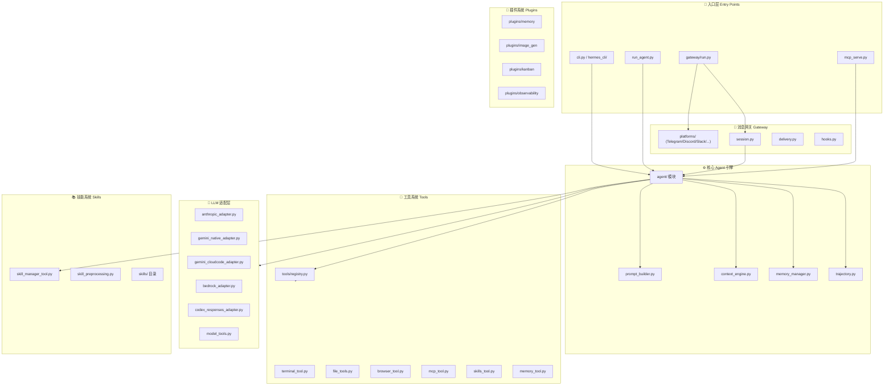
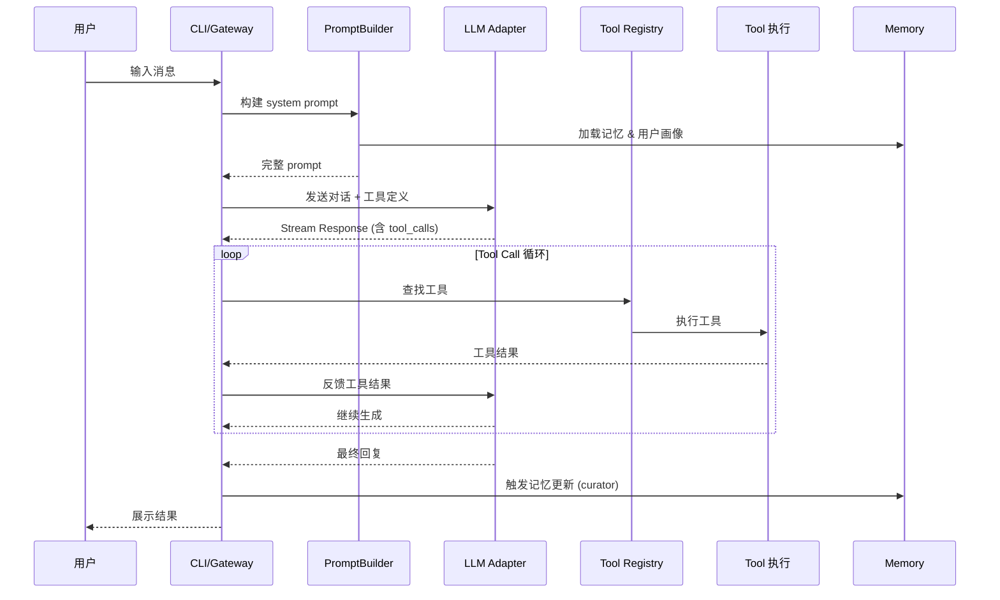

# Hermes Agent 架构全景分析

> **项目**: [NousResearch/hermes-agent](https://github.com/NousResearch/hermes-agent) — "The agent that grows with you"
> **语言**: Python 88.1% / TypeScript 8.5% | **许可**: MIT | ⭐ 130k | 最新版 v0.12.0

---

## 一、整体架构总览



---

## 二、分层详解（从底层到上层）

### 第 1 层：基础设施 & 配置

| 文件 | 作用 | 二次开发要点 |
|------|------|-------------|
| `pyproject.toml` | 项目依赖、构建配置、可选 extras (`[all]`, `[termux]`, `[dev]`) | 添加新依赖在此处 |
| `hermes_constants.py` | 全局常量定义（路径、默认值、版本号） | 修改默认行为 |
| `hermes_state.py` | **全局状态管理** — 会话状态、配置持久化 | 添加新状态字段 |
| `hermes_logging.py` | 日志系统配置 | 自定义日志格式 |
| `hermes_time.py` | 时间工具函数 | — |
| `utils.py` | 通用工具函数集 | — |
| `.env.example` | 环境变量模板 | 添加新 API Key |
| `cli-config.yaml.example` | CLI 配置文件模板 | 新增配置项 |

### 第 2 层：LLM 适配层 (`agent/` 内)

这一层将不同 LLM 提供商的 API 抽象为统一接口，是**多模型支持**的核心。

| 文件 | 作用 |
|------|------|
| `model_tools.py` (根目录) | **模型工具定义** — 将工具 schema 转换为各模型格式 |
| `agent/anthropic_adapter.py` | Anthropic Claude API 适配（含 prompt caching） |
| `agent/gemini_native_adapter.py` | Google Gemini 原生 API 适配（含 thinking 模式） |
| `agent/gemini_cloudcode_adapter.py` | Google Cloud Code Assist 适配 |
| `agent/gemini_schema.py` | Gemini 工具/函数 schema 转换 |
| `agent/bedrock_adapter.py` | AWS Bedrock 适配 |
| `agent/codex_responses_adapter.py` | OpenAI Codex/Responses API 适配 |
| `agent/moonshot_schema.py` | Kimi/Moonshot 特殊 schema 处理 |
| `agent/lmstudio_reasoning.py` | LM Studio 本地推理适配 |
| `agent/google_code_assist.py` | Google Code Assist 集成 |
| `agent/google_oauth.py` | Google OAuth 认证流程 |
| `agent/model_metadata.py` | 模型元信息（上下文窗口、价格等） |
| `agent/models_dev.py` | 开发/测试模型配置 |
| `agent/auxiliary_client.py` | 辅助 LLM 客户端（用于摘要、分类等） |

> [!TIP]
> **二次开发**：要添加新 LLM 提供商，参考 `anthropic_adapter.py` 的结构编写新适配器，核心是实现 streaming completion 和 tool call 解析。

### 第 3 层：Agent 核心引擎 (`agent/`)

这是整个项目的**心脏**，控制 Agent 的推理循环。

| 文件 | 作用 |
|------|------|
| `agent/__init__.py` | Agent 类主入口 — **核心 Agent Loop** 在此实现 |
| `agent/prompt_builder.py` | **系统提示构建** — 组装 system prompt（人格 + 工具 + 上下文 + 记忆） |
| `agent/context_engine.py` | **上下文引擎** — 管理注入到对话中的上下文（文件、URL等） |
| `agent/context_compressor.py` | 上下文压缩 — 当对话过长时智能压缩 |
| `agent/context_references.py` | 上下文引用管理 |
| `agent/trajectory.py` | **轨迹记录** — 记录 Agent 操作轨迹用于 RL 训练 |
| `agent/display.py` | 输出展示格式化 |
| `agent/error_classifier.py` | 错误分类 — 区分可重试/不可重试错误 |
| `agent/retry_utils.py` | 重试逻辑（指数退避） |
| `agent/rate_limit_tracker.py` | API 速率限制跟踪 |
| `agent/nous_rate_guard.py` | Nous Portal 专用速率保护 |
| `agent/prompt_caching.py` | Prompt 缓存优化（减少 token 消耗） |
| `agent/redact.py` | 敏感信息脱敏 |
| `agent/title_generator.py` | 会话标题自动生成 |
| `agent/onboarding.py` | 首次使用引导流程 |
| `agent/insights.py` | 使用洞察分析 |
| `agent/usage_pricing.py` | Token 用量 & 费用计算 |
| `agent/account_usage.py` | 账户用量追踪 |

> [!IMPORTANT]
> **Agent Loop 核心流程** (`agent/__init__.py`)：
> 1. `prompt_builder` 构建 system prompt
> 2. 调用 LLM 适配器获取 streaming response
> 3. 解析 tool calls → 执行工具 → 将结果反馈给 LLM
> 4. 循环直到 LLM 返回最终文本
> 5. `trajectory.py` 记录完整轨迹

### 第 4 层：工具系统 (`tools/`)

工具是 Agent 与外部世界交互的能力单元。

#### 核心框架

| 文件 | 作用 |
|------|------|
| `tools/registry.py` | **工具注册表** — 工具的发现、注册、启用/禁用 |
| `toolsets.py` (根目录) | 工具集定义 — 预设工具组合 |
| `toolset_distributions.py` | 工具集分发逻辑 |
| `tools/approval.py` | **命令审批机制** — 危险操作需用户确认 |
| `tools/tool_output_limits.py` | 工具输出截断/限制 |
| `tools/tool_result_storage.py` | 工具结果持久化 |
| `tools/tool_backend_helpers.py` | 工具后端辅助函数 |
| `tools/schema_sanitizer.py` | 工具 schema 清洗（兼容不同模型） |
| `tools/interrupt.py` | 工具执行中断机制 |

#### 内置工具

| 文件 | 工具功能 |
|------|---------|
| `terminal_tool.py` | **终端命令执行** — Shell 命令运行 |
| `file_tools.py` | **文件操作** — 读写、搜索、编辑 |
| `file_operations.py` | 文件操作底层实现 |
| `file_state.py` | 文件状态追踪 |
| `browser_tool.py` | **浏览器自动化** — Playwright 网页操作 |
| `browser_cdp_tool.py` | Chrome DevTools Protocol 直接控制 |
| `browser_camofox.py` | CamoFox 反检测浏览器 |
| `browser_camofox_state.py` | CamoFox 状态管理 |
| `browser_supervisor.py` | 浏览器监督逻辑 |
| `browser_dialog_tool.py` | 浏览器弹窗处理 |
| `web_tools.py` | **网页搜索 & URL 读取** |
| `vision_tools.py` | **视觉工具** — 图片理解 |
| `image_generation_tool.py` | **图片生成** |
| `memory_tool.py` | **记忆工具** — MEMORY.md / USER.md 读写 |
| `mcp_tool.py` | **MCP 服务器集成** — 连接外部 MCP 工具 |
| `mcp_oauth.py` / `mcp_oauth_manager.py` | MCP OAuth 认证 |
| `code_execution_tool.py` | **代码执行沙箱** |
| `cronjob_tools.py` | **定时任务** — Cron 调度 |
| `send_message_tool.py` | 消息发送（跨平台） |
| `session_search_tool.py` | 历史会话搜索 |
| `tts_tool.py` | 文字转语音 |
| `transcription_tools.py` | 语音转文字 |
| `voice_mode.py` | 语音模式 |
| `delegate_tool.py` | 子 Agent 委托 |
| `todo_tool.py` | TODO 管理 |
| `kanban_tools.py` | 看板管理 |
| `homeassistant_tool.py` | Home Assistant 智能家居 |
| `discord_tool.py` | Discord 集成 |
| `clarify_tool.py` | 澄清/追问工具 |
| `debug_helpers.py` | 调试辅助 |

#### 安全 & 防护

| 文件 | 作用 |
|------|------|
| `agent/tool_guardrails.py` | 工具调用安全护栏 |
| `agent/file_safety.py` | 文件操作安全检查 |
| `tools/path_security.py` | 路径安全校验 |
| `tools/url_safety.py` | URL 安全检查 |
| `tools/tirith_security.py` | Tirith 安全策略引擎 |
| `tools/website_policy.py` | 网站访问策略 |

> [!TIP]
> **二次开发**：添加新工具只需在 `tools/` 下创建新文件，实现标准工具函数，然后在 `registry.py` 中注册。

### 第 5 层：技能系统 (`skills/`)

技能是更高层的可复用知识单元，Agent 可以自主创建和改进技能。

| 组件 | 位置 | 作用 |
|------|------|------|
| 技能管理器 | `tools/skill_manager_tool.py` | 技能的 CRUD 操作 |
| 技能预处理 | `agent/skill_preprocessing.py` | 技能加载 & 预处理注入 |
| 技能命令 | `agent/skill_commands.py` | `/skill` 相关命令处理 |
| 技能工具 | `agent/skill_utils.py` | 技能通用工具函数 |
| 技能同步 | `tools/skills_sync.py` | 技能远程同步 |
| 技能中心 | `tools/skills_hub.py` | agentskills.io 集成 |
| 技能守卫 | `tools/skills_guard.py` | 技能安全检查 |
| 技能使用 | `tools/skill_usage.py` | 技能使用统计 |
| 内置技能目录 | `skills/` | 按分类组织的内置技能 |

**内置技能分类**：
- `skills/apple/` — Apple 生态集成
- `skills/autonomous-ai-agents/` — 子 Agent 编排
- `skills/creative/` — 创意内容生成
- `skills/data-science/` — 数据分析
- `skills/devops/` — DevOps 工具链
- `skills/software-development/` — 软件开发辅助
- `skills/research/` — 深度研究
- `skills/social-media/` — 社交媒体管理
- `skills/smart-home/` — 智能家居
- `skills/mcp/` — MCP 协议相关

### 第 6 层：记忆 & 用户模型

| 文件 | 作用 |
|------|------|
| `agent/memory_manager.py` | **记忆管理核心** — MEMORY.md 和 USER.md 的读写逻辑 |
| `agent/memory_provider.py` | 记忆提供者抽象（支持 Honcho 等外部记忆系统） |
| `tools/memory_tool.py` | Agent 可调用的记忆工具 |
| `plugins/memory/` | 记忆插件（如 Honcho 集成） |
| `agent/curator.py` | **知识策展** — 自主整理和优化记忆 |
| `agent/curator_backup.py` | 策展备份 |
| `agent/manual_compression_feedback.py` | 手动压缩反馈 |
| `trajectory_compressor.py` | 轨迹压缩（用于长对话） |

> [!NOTE]
> Hermes 的"自我改进"核心：Agent 通过 `curator.py` 自主将有价值的交互提炼为记忆，通过 `skill_manager_tool.py` 将常用流程固化为技能。

### 第 7 层：消息网关 (`gateway/`)

让 Agent 可通过 Telegram、Discord 等平台通信。

| 文件 | 作用 |
|------|------|
| `gateway/run.py` | 网关启动入口 |
| `gateway/config.py` | 网关配置 |
| `gateway/session.py` | **会话管理** — 每个聊天的独立会话 |
| `gateway/session_context.py` | 会话上下文 |
| `gateway/delivery.py` | 消息投递（发送响应） |
| `gateway/stream_consumer.py` | 流式响应消费 |
| `gateway/platform_registry.py` | 平台注册表 |
| `gateway/channel_directory.py` | 频道目录 |
| `gateway/hooks.py` | 消息钩子系统 |
| `gateway/builtin_hooks/` | 内置钩子 |
| `gateway/mirror.py` | 消息镜像 |
| `gateway/pairing.py` | 设备配对 |
| `gateway/status.py` | 网关状态 |
| `gateway/restart.py` | 重启逻辑 |
| `gateway/sticker_cache.py` | 贴纸缓存 |
| `gateway/display_config.py` | 显示配置 |
| `gateway/runtime_footer.py` | 运行时页脚 |
| `gateway/whatsapp_identity.py` | WhatsApp 身份管理 |
| `gateway/platforms/` | **各平台实现** (Telegram, Discord, Slack, WhatsApp, Signal, Email) |

### 第 8 层：入口点 & CLI

| 文件 | 作用 |
|------|------|
| `hermes` (根目录脚本) | Shell 入口脚本 |
| `cli.py` | **CLI 主入口** — 参数解析、子命令路由 |
| `hermes_cli/` | CLI 子命令模块 |
| `run_agent.py` | **Agent 运行器** — 初始化并启动 Agent Loop |
| `mcp_serve.py` | **MCP 服务器模式** — 将 Hermes 暴露为 MCP Server |
| `batch_runner.py` | 批量运行器 |
| `mini_swe_runner.py` | SWE-bench 评估运行器 |
| `rl_cli.py` | RL 训练 CLI |

### 第 9 层：插件系统 (`plugins/`)

可选的功能扩展模块。

| 插件 | 作用 |
|------|------|
| `plugins/memory/` | Honcho 记忆后端 |
| `plugins/image_gen/` | 图片生成扩展 |
| `plugins/kanban/` | 看板管理 |
| `plugins/context_engine/` | 上下文引擎扩展 |
| `plugins/google_meet/` | Google Meet 集成 |
| `plugins/spotify/` | Spotify 控制 |
| `plugins/hermes-achievements/` | 成就系统 |
| `plugins/disk-cleanup/` | 磁盘清理 |
| `plugins/observability/langfuse/` | Langfuse 可观测性 |
| `plugins/platforms/` | 平台扩展 |
| `plugins/strike-freedom-cockpit/` | 驾驶舱 UI |
| `plugins/example-dashboard/` | 示例仪表盘 |

### 第 10 层：RL 训练 & 数据生成

| 组件 | 作用 |
|------|------|
| `environments/` | RL 训练环境定义 |
| `tinker-atropos/` (submodule) | Atropos RL 框架集成 |
| `datagen-config-examples/` | 数据生成配置示例 |
| `agent/trajectory.py` | 轨迹记录 |
| `trajectory_compressor.py` | 轨迹压缩 |

### 辅助层

| 目录/文件 | 作用 |
|-----------|------|
| `agent/credential_pool.py` | API Key 池管理 |
| `agent/credential_sources.py` | 凭据来源 |
| `tools/credential_files.py` | 凭据文件管理 |
| `agent/image_gen_provider.py` | 图片生成提供者 |
| `agent/image_gen_registry.py` | 图片生成注册表 |
| `agent/image_routing.py` | 图片路由 |
| `agent/shell_hooks.py` | Shell 钩子 |
| `agent/subdirectory_hints.py` | 子目录提示 |
| `agent/transports/` | 传输层抽象 |
| `acp_adapter/` | ACP 协议适配器 |
| `acp_registry/` | ACP 注册表 |
| `tui_gateway/` | TUI 网关 |
| `ui-tui/` | 终端 UI |
| `web/` | Web 界面 |
| `website/` | 官网 |
| `docker/` | Docker 配置 |
| `nix/` | Nix 包管理 |
| `scripts/` | 安装/构建脚本 |
| `tests/` | 测试套件 |

---

## 三、核心数据流



---

## 四、二次开发指南

### 1. 添加新的 LLM 提供商

```
位置: agent/your_adapter.py
参考: agent/anthropic_adapter.py

关键接口:
- stream_chat_completion() — 流式对话补全
- parse_tool_calls() — 解析 tool calls
- format_tools() — 工具 schema 转换
```

### 2. 添加新工具

```
位置: tools/your_tool.py
注册: tools/registry.py

步骤:
1. 定义工具函数 (带类型注解)
2. 编写工具 schema (OpenAI function calling 格式)
3. 在 registry.py 中注册
4. 在 toolsets.py 中添加到合适的工具集
```

### 3. 添加新技能

```
位置: skills/your-category/your-skill/SKILL.md

技能结构:
your-skill/
├── SKILL.md          # 技能说明 (必须)
├── scripts/          # 辅助脚本
├── examples/         # 示例
└── resources/        # 资源文件
```

### 4. 添加新消息平台

```
位置: gateway/platforms/your_platform.py
注册: gateway/platform_registry.py

关键接口:
- start() — 启动平台连接
- send_message() — 发送消息
- on_message() — 接收消息回调
```

### 5. 添加新插件

```
位置: plugins/your-plugin/
参考: plugins/memory/ 或 plugins/kanban/
```

### 快速上手命令

```bash
# 克隆 & 安装开发环境
git clone https://github.com/NousResearch/hermes-agent.git
cd hermes-agent
./setup-hermes.sh

# 或手动
uv venv venv --python 3.11
source venv/bin/activate
uv pip install -e ".[all,dev]"

# 运行测试
scripts/run_tests.sh

# 启动
./hermes
```

---

## 五、关键设计模式总结

| 模式 | 应用位置 | 说明 |
|------|---------|------|
| **适配器模式** | `agent/*_adapter.py` | 统一多 LLM 接口 |
| **注册表模式** | `tools/registry.py`, `gateway/platform_registry.py` | 动态发现 & 注册 |
| **策略模式** | `toolsets.py` | 不同场景的工具组合 |
| **观察者/钩子** | `gateway/hooks.py` | 消息生命周期拦截 |
| **策展人模式** | `agent/curator.py` | Agent 自主知识管理 |
| **分层压缩** | `context_compressor.py`, `trajectory_compressor.py` | 长对话处理 |

> [!CAUTION]
> 你在之前的对话 `0c0ea57a` 中遇到的 Gemini `thought_signature` 错误正是发生在 LLM 适配层。二次开发时务必注意各适配器对 thinking/reasoning 模式特殊字段的保留处理。
