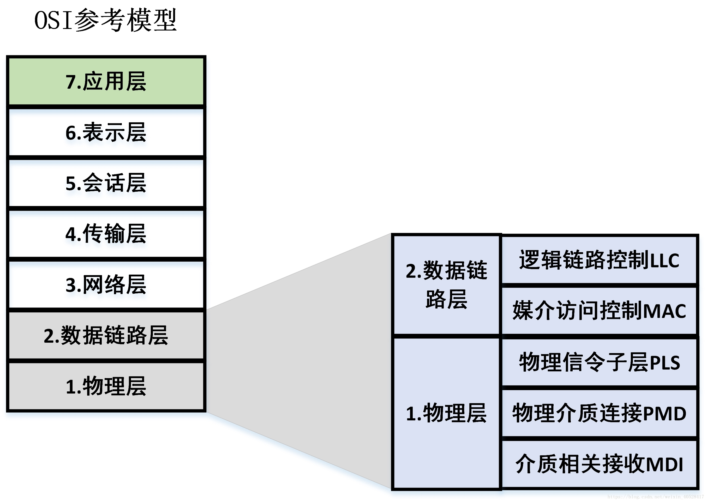

01 CAN协议介绍

# 1. CAN的一些基本概念

## 1.1 什么是CAN总线

CAN 是 Controller Area Network 的缩写，是 ISO 国际标准化的**串行通信协议**。通俗来讲，**CAN总线**就是一种**传输数据的线**，用于在不同的ECU之间传输数据。
CAN总线有两个ISO国际标准：ISO11898 和 ISO11519。其中：

- **ISO11898** 定义了通信速率为 125 kbps～1 Mbps 的**高速 CAN** 通信标准，属于**闭环总线**，传输速率可达1Mbps，总线长度 ≤ 40米。
- **ISO11519** 定义了通信速率为 10～125 kbps 的**低速 CAN** 通信标准，属于**开环总线**，传输速率为40kbps时，总线长度可达1000米。

> Tips: **<总线的传输速率>**：又称为**总线的通信速率**，指的是**位速率**。或称为**比特率**（和波特率不是一回事），表示的是：单位时间内，通信线路上传输的二进制位的数量，其基本单位是 bps 或者 b/s (bit per second)。

## 1.2 CAN的拓扑结构

下图中，左边是高速CAN总线的拓扑结构，右边是低速CAN总线的拓扑结构

如图中所示，CAN总线包括CAN_H 和 CAN_L 两根线。节点通过**CAN控制器**和**CAN收发器**连接到CAN总线上。

> Tips ：通常来讲，ECU内部集成了CAN控制器和CAN收发器，但是也有没集成的，需要自己外加。

## 1.3 CAN信号表示

在CAN总线上，利用CAN_H和CAN_L两根线上的电位差来表示CAN信号。CAN总线上的电位差分为**显性电平**和**隐性电平**。其中**显性电平**为逻辑**0**，**隐性电平**为逻辑**1**。
ISO11898标准（125kbps ~ 1Mbps）和ISO11519标准（10kbps ~ 125kbps）中CAN信号的表示分别如下所示：

## 1.4 CAN信号传输

**发送过程：**
CAN控制器将CPU传来的信号转换为逻辑电平（即逻辑0-显性电平或者逻辑1-隐性电平）。CAN发射器接收逻辑电平之后，再将其转换为差分电平输出到CAN总线上。

**接收过程：**
CAN接收器将CAN_H 和 CAN_L 线上传来的差分电平转换为逻辑电平输出到CAN控制器，CAN控制器再把该逻辑电平转化为相应的信号发送到CPU上。

概括的讲：

- 发送方通过**使总线电平发生变化**，将其信息传递到CAN总线上。
- 接收方通过监听总线电平，将总线上的消息读入自己的接收器。

# 2 CAN通信的特点

## 2.1 多主工作方式

所谓多主工作方式，指的是：总线上的所有节点没有主从之分，大家都处于平等的地位。反应在数据传输上，即是：在总线空闲状态，任意节点都可以向总线上发送消息。

> Tips: **<总线空闲状态>**：当总线上的上出现**连续的11位隐性电平**，那么总线就处于空闲状态。也就是说对于任意一个节点而言，只要它监听到总线上连续出现了11位隐性电平，那么该节点就会认为总线当前处于空闲状态，它就会立即向总线上发送自己的报文。
> 至于为什么连续出现11位隐性电平，就可以判定+总线处于空闲状态，这个问题可以结合CAN协议的帧结构来进行理解。

在多主工作方式下：

- 最先向总线发送消息的节点获得总线的发送权；
- 当多个节点同时向总线发送消息时，所发送消息的优先权高的那个节点获得总线的发送权。
  例如：Node_A和Node_B同时向总线发送各自的消息Msg_1和Msg_2，如果Msg_1的优先级比Msg_2高，那么Node_A就获得了总线的发送权。

## 2.2 非破坏性位仲裁机制

在CAN协议中，所有的消息都以固定的帧格式发送。当多个节点同时向总线发送消息时，对各个消息的标识符（即ID号）进行**逐位仲裁**，如果某个节点发送的消息仲裁获胜，那么这个节点将获取总线的发送权，仲裁失败的节点则立即停止发送并转变为监听（接收）状态。
例如：Node_A和Node_B同时向总线发送各自的消息Msg_1和Msg_2，那么对Msg_1的ID号ID_1和Msg_2的ID号ID_2进行逐位仲裁，如果仲裁结果是：ID_1的优先级比ID_2高，那么Msg_1在仲裁中获胜，于是发出Msg_1这条报文的节点Node_A就获得了总线的发送权。同时，Msg_2在仲裁中失败，于是Node_B就转换到监听总线电平的状态。

这种仲裁机制既**不会造成已发送数据的延迟**，也**不会破坏已经发送的数据**，所以称为非破坏性仲裁机制。

## 2.3 系统的柔性

CAN总线上的节点**没有“地址”的概念**，因此在总线上增加节点时，不会对总线上已有节点的软硬件及应用层造成影响。

## 2.4 通信速度

在同一条CAN线上，所有节点的通信速度（位速率）必须相同，如果两条不同通信速度总线上的节点想要实现信息交互，必须通过网关。
例如：汽车上一般有两条CAN总线：500kbps的驱动系统CAN总线和125kbps的舒适系统CAN总线，如果驱动系统CAN总线上的发动机节点要把自己的转速信息发送给舒适系统CAN总线上的转速表节点，那么这两条总线必须通过网关相连。

## 2.5 数据传输方式

CAN总线可以实现一对一，一对多以及广播的数据传输方式，这依赖于验收滤波技术。验收滤波技术的实现机制参见本系列笔记的第二篇CAN协议帧结构中的介绍。

## 2.6 远程数据请求

某个节点Node_A可以通过发送“遥控帧”到总线上的方式，请求某个节点Node_B来发送由该遥控帧所指定的报文。具体实现方式参见本系列笔记的第二篇CAN协议帧结构中的介绍。

## 2.7 错误检测、错误通知、错误恢复功能

- 所有的节点都可以检测出错误（错误检测功能）；
- 检测出错误的节点会立即通知总线上其它所有的节点（错误通知功能）；
- 正在发送消息的节点，如果检测到错误，会立即停止当前的发送，并在同时不断地重复发送此消息，直到该消息发送成功为止（错误恢复功能）。

## 2.8 故障封闭

节点能够判断错误的类型，判断是暂时性的数据错误（如噪声干扰）还是持续性的数据错误（如节点内部故障），如果判断是严重的持续性错误，那么节点就会切断自己与总线的联系，从而避免影响总线上其他节点的正常工作。

CAN通信的上述特点都是基于CAN协议所定义的多种帧结构来实现的，因此，在下一篇笔记对CAN的帧结构有了了解之后，再做进一步的详细解释。

# 3 CAN通信网络结构

## 3.1 OSI基本参照模型

实际上，CAN总线网络底层只采用了OSI基本参照模型中的**数据链路层、传输层**。而在CAN网络高层仅采用了OSI基本参照模型的**应用层**

## 3.2 CAN协议网络层次

在CAN协议中，ISO标准只对数据链路层和物理层做了规定。对于数据链路层和物理层的一部分，ISO11898和ISO11519-2的规定是相同，但是在物理层的PMD子层和MDI子层是不同的。

在CAN总线，每一层网络中定义的事项如下：

