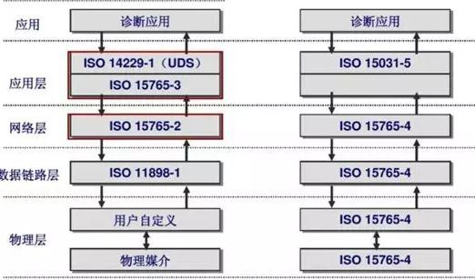
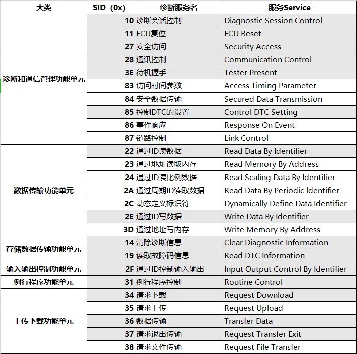
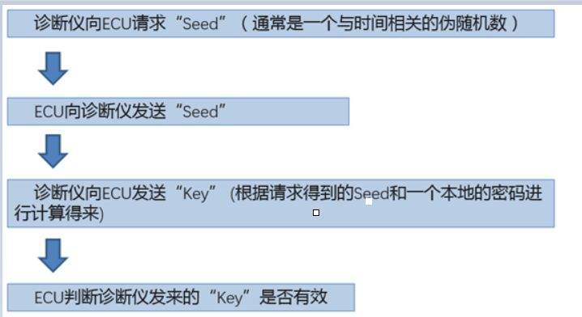
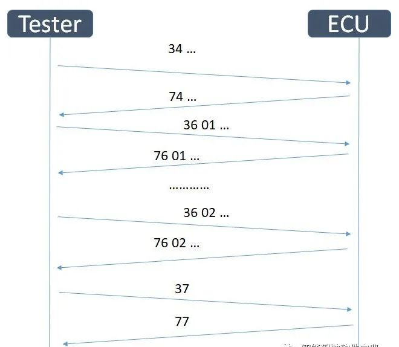

# 02 14229协议介绍

## 一、概述

ISO-14229标准，也称UDS，是一种面向汽车控制单元ECU的同意诊断服务，是目前汽车电子领域运用最广的技术协议之一。UDS是ISO-14229定义的基于OSI模型中应用层的协议。其中，ISO 14229-1定义了诊断服务，但不涉及网络层及实现手段，只有应用层的内容，因此可在不同的汽车总线（如CAN, LIN, Flexray, Ethernet和K-line等）上实现。结合ISO 15765-3和ISO 14229-1则实现了基于CAN总线的UDS汽车统一诊断服务。如下图所示：

UDS是一种Client/Server的通信服务，即Tester向ECU发送诊断请求Request，ECU回复对应请求服务的响应Response。UDS定义了五种诊断服务内容，细分为26个服务ID，并为每个ID定义了子功能、寻址方式和参数等，如图。

ISO14229系列，涵盖了UDS的服务定义以及在各车载总线上的一些特殊应用指导，以及各总线类型所对应的下层协议要求，下面就是该系列中各协议所对应的内容清单。

| 协议编号 | 协议名称               | 协议内容                                                    |
| -------- | ---------------------- | ----------------------------------------------------------- |
| 14229-1  | Application layer      | UDS的使用规则，服务，以及相关的服务原语(接口定义)           |
| 14229-2  | Session layer services | 会话层的使用规则                                            |
| 14229-3  | UDSonCAN               | 在CAN总线上应用时一些特殊服务规则和其他层遵循的协议要求     |
| 14229-4  | UDSonFR                | 在Flexray总线上应用时一些特殊服务规则和其他层遵循的协议要求 |
| 14229-5  | UDSonIP                | 在Ethernet上应用时一些特殊服务规则和其他层遵循的协议要求    |
| 14229-6  | UDSonK-Line            | 在K线上应用时一些特殊服务规则和其他层遵循的协议要求         |
| 14229-7  | UDSonLIN               | 在LIN总线上应用时一些特殊服务规则和其他层遵循的协议要求     |
| 14229-8  | UDSonCXPI              | 在CXPI总线上应用时一些特殊服务规则和其他层遵循的协议要求    |

## 二、14229标准基本知识

UDS本质上是一种定向的通信，是一种交互协议（Request/Response），即诊断方给ECU发送指定的请求数据（Request），ECU反馈给诊断方信息（Response）。

Diagnostic Request的格式：

DiagnosticRequest的格式可以分为两类：

一类是拥有sub-function的；

一类是没有sub-function的；

Service ID(以下简称SID)的长度固定为1个字节，代表了这条诊断命令执行的什么功能。Sub-function的长度也是1个字节，它通常表示对这个诊断服务的具体操作，比如是启动、停止还是查询这个诊断服务。而后面的Parameter则根据各个诊断服务的不同具有不同的内容，长度和格式并没有统一规格，它用于限定诊断服务执行的条件，比如某个诊断服务执行的时间等。Parameter的一个重要应用是作为标识符，标识诊断请求要读出的数据内容。

有一点要补充的是，其实Sub-function严格来说是7个bit，而不是1个byte，因为它的最高位bit被用于抑制正响应（Suppress Ppositive Response, SPR），如果这个bit被置1，则ECU不会给出正响应（PositiveResponse）；如果这个bit被置0，则ECU会给出正响应。这样做的目的是可以告诉ECU不要发不必要的Response，从而节约通信资源。

Diagnostic Response的格式：

Diagnosticresponse分为positive和negative两类。

positive response意味着诊断仪发过来的诊断请求被执行了，而negativeresponse则意味着ECU因为某种原因无法执行诊断仪发过来的诊断请求，而无法执行的原因则存在于negative response报文中的NRC中

（1）服务ID

标准定义了25种不同的诊断服务，每个服务使用一个字节的ID作为唯一识别码，例如会话控制服务：0x10

（2）子功能

有些诊断服务支持子功能，以区分具体的服务类型。例如会话控制服务的子功能：0x01对应切换到默认会话模式；0x02对应切换到编程会话模式；0x03对应切换到扩展会话模式。

（3）参数

用于描述诊断服务的额外信息，例如读取故障码信息服务0x19的读取故障码信息0x02后需要接一个字节的数据，该数据就是其参数。

（4）寻址

Tester发送Request的目标ECU地址根据其寻址方式指定：物理寻址是一对一通信，功能寻址是一对多通信。

（5）负响应码

当请求服务执行失败时，ECU向Tester反馈失败的原因代号，即负响应码NRC，常见负响应码如图

| 否定响应码（NRC） | 描述                                         |                                |
| ----------------- | -------------------------------------------- | ------------------------------ |
| 0x10              | General Reject                               | 该否定响应不是协议里已定义的   |
| 0x11              | Service Not Supported                        | 服务不支持                     |
| 0x12              | Sub-function Not Supported                   | 子功能不支持                   |
| 0x13              | Incorrect Message Length or Invalid Format   | 请求报文的格式或者长度不正确   |
| 0x22              | Conditions Not Correct                       | 先决条件不满足                 |
| 0x24              | Request Sequence Error                       | 请求报文的顺序不正确           |
| 0x31              | Request Out of Range                         | 参数超出范围/数据ID不支持      |
| 0x33              | Security Access Denied                       | 不满足安全策略，请先解锁       |
| 0x35              | Invalid Key                                  | 密钥不匹配（27服务）           |
| 0x36              | Exced Number of Attempts                     | 尝试解锁次数已达上限（27服务） |
| 0x37              | Required Time Delay Not Expired              | 超时时间未到（27服务）         |
| 0x70              | Upload/Download Not Accepted                 | 不允许上传/下载（34服务）      |
| 0x71              | Transfer Data Suspened                       | 数据传输中止                   |
| 0x72              | General Programming Failure                  | 擦除或者烧写内存时错误         |
| 0x73              | Wrong Block Sequence Counter                 | 块序列计数错误                 |
| 0x78              | Request Correctly Received - Respone Pending | 已收到请求，但会晚些响应       |
| 0x7E              | Sub-function Not Supported in Active Session | 当前会话下，该子功能不支持     |
| 0x7F              | Service Not Supported in Active Session      | 当前会话下，该服务不支持       |
| 0x92              | Voltage Too High                             | 电压过高                       |
| 0x93              | Voltage Too Low                              | 电压过低                       |

## 三、诊断服务内容

（1）报文基本格式

诊断报文的基本格式为：SID+子功能+参数；没有子功能的服务，其格式为：SID+参数；如下

| 是否带子功能 | 报文类型 | 格式                                      |
| ------------ | -------- | ----------------------------------------- |
| 是           | 请求帧   | <SID> + <Sub-Function> + <Parameter>      |
|              | 正响应帧 | <SID+0x40> + <Sub-Function> + <Parameter> |
|              | 负响应帧 | <0x7F> + <SID> + <NRC>                    |
| 否           | 请求帧   | <SID> + <Parameter>                       |
|              | 正响应帧 | <SID+0x40> + <Parameter>                  |
|              | 负响应帧 | <0x7F> + <SID> + <NRC>                    |

响应报文的规律是：正响应报文的SID字段在请求报文的基础上增加了0x40；所有服务的负响应的SID字段都是7F，后接具体服务和NRC

（2）响应机制

ECU主要根据诊断服务请求报文的SID+子功能+参数个字段进行响应

### 诊断和通信管理类服务

#### 1. DiagnosticSessionControl(0x10)

$10用于控制ECU在不同的session之间进行转换，session可以看作是ECU所处的一种软件状态，在不同的session中诊断服务执行的权限不同。其Request请求格式如下所示

DiagnosticSessionControl诊断request的格式

第一个字节即SID，这里为0x10。第二个自己即$10服务的子功能，功能列表如下所示：

| Bit  | 描述                |          |
| ---- | ------------------- | -------- |
| 01   | Default Session     | 默认会话 |
| 02   | Programming Session | 编程会话 |
| 03   | Extended Session    | 扩展会话 |

ECU上电时，进入的是默认会话0x01（Default）。如果您进入了一个非默认会话的状态，一个定时器会运转，如果一段时间内没有请求，那么到时间后，诊断退回到默认会话01。当然，我们有一个$3E的服务，可以使诊断保持在非默认的状态。

ECU上电之后，由于默认处在0x01 defaultSession中，而在这个session中很多诊断服务不可以执行，导致很多诊断相关的数据不能读取或写入。

一般的诊断仪启动之后，会给ECU发送10 03，即让ECU进入 extendedDiagnosticSession中，在这个session中可执行的诊断服务就很多了。

而如果要让ECU保持在non-defaultSession中，则需要诊断仪每隔固定的时间发送0x3E服务，ECU才会知道诊断仪有和自己通信的需求，从而保持在non-defaultSession中。

另一个常用的session是0x02 ProgrammingSession，在这个session中可以进行软件刷写的一系列诊断服务。

0x40 – 0x5F 这个范围中的session由整车厂自定义使用，比如，某些诊断服务或诊断数据的操作需要在生产线上执行，即所谓的End-Of-Line，整车厂可以从这个范围中选择一个值来表示EOL session；又或者在开发阶段需要某种“超级”session，则也可以从这里选一个值用来使ECU进入开发模式的session。

DiagnosticSessionControl这个服务非常简单，但是它却是ECU和诊断通信的第一条诊断命令。

#### 2. ECUReset (0x11)

ECUReset 这条指令的用途是通过诊断请求使ECU重启。

第一个字节是SID，即0x11。第二个字节的低7bit是sub-function，用于指示ECU将模拟哪种方式进行重启。 常用的sub-function包括（只举2个例子，UDS还定义了很多其他的值）

0x01 hardReset 模拟KL30的重启

0x02 keyOffOnReset 模拟KL15的重启

当我们通过诊断命令改写了ECU的某些数据，或者对ECU进行了某些设置，只有将ECU重启才能将这些配置生效，所以就有了这个诊断命令。在ECUReset 执行之后，ECU会从Non-defaultsession回退到defaultsession中。

#### 3. SecurityAccess(0x27)

厂家可能会为ECU定义某些安全级别稍微高一些的诊断服务，在执行此类服务之前，就需要执行SecurityAccess 这个诊断命令，进行一个简单的身份验证。

完成SecurityAccess 有以下步骤：

根据UDS对$27服务的定义：

0x03, 0x05, 0x07– 0x41 这个范围留给用于requestSeed的sub-function；

0x04, 0x06, 0x08– 0x42 这个范围留给用于sendKey的sub-function。

具体选择哪对值，由整车厂自己定义。整车厂也可以选择多对sub-function，用于不同等级的安全访问。

举例来说：

假设0x05用于requestSeed，0x06用于sendKey。

1. 诊断仪发送 27 05；
2. ECU响应 67 05 01 0101（seed是 01 01 01）;
3. 诊断仪发送 27 06 02 03 04（key值是02 03 04，seed是 01 01 01，假设本地密码为01 02 03，而算法就是将密码与seed相加）;
4. ECU验证成功 67 06;

此时ECU就处于unlocked的状态了，那些被保护起来的诊断服务和诊断数据可以被操作了。通常来说，如果ECU重启，或者回到了default session，unlocked状态就失效了，如果要执行相关诊断服务，则需要再次执行上面描述的过程。

#### 4. CommunicationControl (0x28)

该服务用于打开/关闭某些类别的报文的发送/接收。它通常在刷写软件或大量数据的时候使用，因为在刷软件或参数的时候并不需要ECU进行与通信相关的功能，将通信关闭之后可以把所有通信资源都留给软件或参数的下载，当下载过程完成之后再利用该服务将通信恢复即可。

0x28服务的格式如下图所示

第一部分即SID，一个字节，值为0x28；

第二部分是sub-function，即对ECU的通信进行哪种控制，具体包括 

第三部分表明这条诊断请求要对哪种报文进行控制，长度为1个字节，定义如下表所示：

这个字节中最常用的就是低2 bit，0x1代表普通应用报文，0x2代表网络管理报文，0x3代表普通应用报文和网络管理报文。

第四部分是optional的，只有当sub-functional等于0x04或0x05时才需要使用。

举例来说：

28 01 01 表示激活应用报文的接收并关闭应用报文的发送（网络管理报文不受影响）。

28 00 01 表示激活应用报文的接收和发送（网络管理报文不受影响）。

#### 5. TesterPresent (0x3E)

这个诊断服务的用处可以通过它的名字很明显地得知，即告知ECU诊断仪还在连接着。在$10中提到了关于session的部分，如果没有诊断命令的发送和接收，ECU将从non-default session中回退到default session， 0x3E就是用于使ECU保持在当前session。

这应该是UDS中最简单的一个诊断服务了，它永远只有两个byte，格式如下：

当sub-function是0x00时，ECU要给出response；

当sub-function是0x80时，ECU不需要给出response。

一般来说主机厂会为这个服务定义两个时间参数，一个参数用于规定自己的诊断仪发送0x3E服务的间隔，另一个参数用于定义ECU收不到0x3E服务的timeout时间。

#### 6. ControlDTCSetting (0x85)

该服务用于控制ECU的DTC（diagnostic trouble code，故障诊断码）存储，这个服务常常和前面提到的28服务一起使用，比如，在开始写参数之前，为了获得更快的传输速度，我们用28服务把所有ECU的通信关闭了，但此时因为收到不到相关的报文，ECU会没有必要地存储很多DTC，这时如果我们使用85服务把ECU存储DTC的功能暂时性地禁止掉，则不会造成这种麻烦。

第一部分即SID，一个byte，值为0x85；

第二部分是sub-function，即是打开还是关闭ECU的DTC存储，包括 ：

0x01 on

0x02 off

第三部分是optional的，由各家自己定义，比如，可以用FF FF FF 来表示这条诊断命令针对所有的DTC。

#### 7. ResponseOnEvent (0x86)

尽管诊断通信过程是问答式的，诊断仪发请求，ECU给响应。0x86服务算是一个例外，在ECU收到这条0x86服务之后，当DTC产生时，它会自动地上报DTC及相关环境数据，直到用另一条0x86服务来关闭ECU的这个行为。

该功能主要用于ECU的前期开发阶段，在售后和生产中是不会用到的，而且该服务的格式复杂（即可变的参数很多），执行它还分为好几个步骤，在这里就不过多叙述。

#### 8. LinkControl (0x87)

这个服务用于转化ECU数据链路层和物理层的状态，比如，在高速CAN上的ECU正常通信速率是500kbit/s，但它同时也支持1M bit/s的波特率，如果需要刷写大量数据，便可以利用这条诊断服务让ECU以1M bit/s的波特率进行通信。

这个诊断服务的执行分为两个步骤：

验证ECU是否支持要调整到的目标波特率

让ECU的数据链路层和物理层转到目标波特率的通信状态

只有当第一个步骤验证通过了，第二个步骤才可以成功执行。

### 数据传输类服务

#### 1. ReadDataByIdentifier (0x22)

$22，即读数据

l Request（请求）：22+DID（Data Identifier，通常是两个字节）

l Response（响应）：62+DID+Data

DID有一部分已经被ISO 14229-1规定了。比如0xF186就是当前诊断会话数据标识符，0xF187就是车厂零件号数据标识符，0xF188就是车厂ECU软件号码数据ID，0xF189就是车厂ECU软件版本号数据标识符。

举例来说：

22 F1 87 （读取零件号，DID=F1 87）

62 F1 87 XX YYZZ KK MM NN（给出零件号）

#### 2. WriteDataByIdentifier (0x2E)

l Request（请求）：2E+DID+Data

l Response（响应）：6E+DID

注意，比如0xF186这个DID不支持直接写入数据，需要用$10来进行会话转换。也就是说，对于写数据的请求，一般来说需要在一个非默认会话，和解锁的状态下才能进行。

举例来说：

2E F1 87 XX YY ZZ KK MM NN（写入零件号）

6E F1 87（给出positive response）

#### 3. ReadMemoryByAddress (0x23)

0x23服务的请求格式

第一部分固定为1个byte, 0x23；

第二部分是格式信息，长度为1个byte，高4 bits用于指示memorySize的长度（字节数），低4 bits用于指示memoryAddress的长度（字节数）。比如，如果这个值为0x46，则后面的memorySize为6个byte，memoryAddress为4个byte。

第三部分是memoryAddress信息，它的长度由第二部分的AddressAndLengthFormatIdentifier指示。

第四部分是memorySize信息，它的长度由第二部分的AddressAndLengthFormatIdentifier指示。

如果这条命令的格式是 23 22 xx yy aa bb，则它的含义就是，读取xx yy地址的长度为aa bb的数据。

#### 3. WriteMemoryByAddress (0x3D)

了解了0x23的用法，0x3D的用法就很好理解了，它标识memoryAddress和memorySize的方法与0x23相同，只是在诊断命令最后再加上一段需要写入的数据。

### 存储数据传输服务

存储数据传输服务，用于操作DTC（diagnostic trouble code，故障诊断码）

在 ISO15031-6 中对 DTC 的格式有明确的定义，该规范中定义了 DTC 共由三个字节组成，如下图所示

DTC格式

| 字节1              | 字节2              | 字节3                    |
| ------------------ | ------------------ | ------------------------ |
| 诊断故障代码高字节 | 诊断故障代码低字节 | 诊断故障代码失效类型字节 |

在 ISO15031-6 中对 DTC 格式中的字节 1 与字节 2 也做了具体的定义，通过这个定义可以很方便确定记录的 DTC 属于车上的那种类型。

至此，DTC故障码的概念解释完毕，下面将展开关于存储传输类服务的解读：

这类服务主要涉及到两条诊断命令，分别是：

0x14:ClearDiagnosticInformation

0x19:ReadDTCInformation

这两条服务用于操作存储在ECU中的DTC，使用频率很高，而且它们比较好地体现了“诊断”两个字的含义。

#### 1. ClearDiagnosticInformation（0x14）

这条诊断命令的格式比较简单，用法也很好理解，即删除存储在ECU中的DTC。

第一个字节就是SID了，后边的三个字节用于标识将要被删除的DTC种类，UDS规定用FF FF FF表示所有种类的DTC，由厂家自定义代表Powertrain、Chassis、Body、NetworkCommunication等种类DTC的值。

举例来说

Request：14+FF+FF+FF；（删除掉ECU中的所有DTC）

Response：54 ；

#### 2. ReadDTCInformation（0x19）

这条指令用于读取存储在ECU中的DTC，0x19服务的sub-function代表了各式各样读取DTC的方法，UDS给19服务的sub-function从0x00到0x19进行了明确定义，这里介绍其中常见4种。

- sub-function = 0x01（reportNumberOfDTCByStatusMask）

用于读取符合DTC状态掩码的DTC的数量，此时parameter为一个byte的Mask掩码，用于与DTC的Status进行“与”运算，而ECU返回的则是"与"运算之后结果不为0的DTC的数量。

DTC的Status用一个byte表示，其中的8个bit分别代表DTC的不同状态，比如，bit0 表示这个DTC是active的还是passive的，bit 4表示这个DTC是否已经被confirm了，如果DTC的状态是confirm，则说明该DTC已经被ECU存储下来了。

比如：19 01 08这个命令的用途，就是读取所有状态为confirm的DTC的数量。

- sub-function = 0x02（reportDTCByStatusMask）

用于读取符合特定条件的DTC列表，此时parameter仍然为一个byte的Mask，用于与DTC的Status进行“与”运算，而ECU返回的则是"与"运算之后结果不为0的DTC列表。

比如19 02 01这个命令的用途，就是读取所有状态为active的DTC的数量。此时ECU返回的格式应该是59 02 01 XX XX XX 01 YY YY YY 09......。返回的DTC列表中的每个条目为4个字节，前三个字节用于标识DTC，比如 XX XX XX，最后一个字节用于标识DTC状态，比如01，表示DTC是active的，09表示DTC是active且confirm的。

- sub-function = 0x06（reportDTCExtDataRecordByDTCNumber）

用于读取某个DTC及其相关的环境数据，此时parameter为4个byte，前三个byte用于标识我们要读取的DTC，第四个byte用于标识要读取的环境数据的范围，UDS规定使用FF来表示读取所有的环境数据，各厂家可以要根据自己的需求定义其他的值来代表要读取的环境数据的范围。环境数据包括DTC状态，优先级，发生次数，老化计数器，时间戳，里程等，厂家还可以根据自己的需求定义一些此DTC产生时的测量数据。

比如 19 06 XX XX XX FF就表示读取 XX XXXX这个DTC的所有环境数据，ECU的返回值应该是59 06 XX XX XX AA BB CC DD.....，其中AA BB CCDD...代表的就是XX XX XX这个DTC产生时所一起存储的环境数据。

- sub-function = 0x0E（reportMostRecentConfirmedDTC）

sub-function = 0x0E时，不需要parameter。0x0E表示，要求ECU上报最近的一条被置为confirm的DTC。上文介绍过0x86服务，sub-function = 0x0E的19服务通常被作为参数传递给86指令，要求ECU在发生DTC存储的时候进行自动上报，即19 0E这两个字节的指令被嵌入到86服务的命令中。这条命令在开发阶段会用到，比如验证某个故障路径是否生效。

### IO控制服务

#### 1. **InputOutputControlByIdentifier (0x2F)**

$2F这个服务即利用ID对[ECU](https://so.csdn.net/so/search?q=ECU&spm=1001.2101.3001.7020)的输入输出进行控制，经常会在生产线上使用来验证零部件的功能。比如，在总装阶段，工人需要验证车上的各种功能是否正常，例如四个车窗的升降是否正常，如果挨个开关去按，那效率很低，如果通过一个诊断命令就能够观察到车窗升降的情况，效率则高得多。

比如，ECU接收一个输入信号A，我们就可以利用2F给这个A赋个我们需要的值；ECU对某个执行器B进行控制，我们就可以利用2F服务再配上某些特定的参数来实现对B的控制，例如门控对车窗升降、后视镜折叠等的控制。

$2F服务的request由4部分组成

第一个字节：[SID](https://so.csdn.net/so/search?q=SID&spm=1001.2101.3001.7020)=0x2F

第二三个字节：dataIdentifier(2 byte)，用于标识被控制的IO对象，例如下文举例0x9B00（进气口门位置）

第四个字节：controlOptionRecord，用于标识控制类型，以及若干byte由厂家自定义使用的controlState。UDS明确定义了四种控制类型

0x00 将控制权还给ECU，即结束控制

0x01 将DID标识的对象的输入信号、内部参数、输出信号等设为默认值

0x02 将DID标识的对象的的输入信号、内部参数、输出信号等冻结住

0x03 将DID标识的对象的的输入信号、内部参数、输出信号进行设置，其实就相当于开始了对ECU的控制，这种控制类型其后会跟着第五个字节，可以表示控制对象的数字量或模拟量。

举例来说：

使用2F控制Air Inlet Door Position （进气口门位置），用DID（标识符）=0x9B00来标识进气口门的位置。

Air Inlet Door Position [%] = decimal(Hex) * 1 [%] ，即用一个百分比来表示这个位置。

**step1:**

tester 发送22 9B 00读取当前进气口门的位置，这里22即SID，0x9B00即第二三字节DID。

ECU返回62 9B 00 0A ，这里 0x0A = 10（dec），即表示当前位置是10%

（UDS定义可以用22服务读取2F服务中使用的dataIdentifier，返回值是状态信息，具体的状态信息是什么，则由使用者自定义了。）

**step2:**

tester 发送2F 9B 00 03 3C ，表示要将进气口门的位置调整到60%，0x3C = 60（dec）表示要将控制对象的模拟量设定为60%。

ECU返回6F 9B 00 03 0C，表示接受控制，当前进气口门的位置为12%。因为ECU收到请求后是立刻响应的，而门的位置调节需要时间，所以还没有达到60%。

**step3:**

过一段时间后tester 发送22 9B 00读取当前进气口门的位置

ECU返回62 9B 00 3C ， 0x3C = 60（dec），表示当前位置已经到了60%

**step4:**

tester 发送2F 9B 00 00，将控制权交还给ECU

ECU返回6F 9B 00 00 3A，表示接受请求，当前位置为58%

**step5:**

tester 发送2F 9B 00 02，冻结9B 00这个ID所代表的进气口门位置这个状态

ECU返回6F 9B 00 02 32，表示接受请求，当前位置保持在50%

### 例行程序控制服务

#### 1. **RoutineControl (0x31)**

$31服务是调用ECU内置的一些操作序列的接口，这个服务的应用很灵活，因为厂家可以根据自己的需要为ECU定义各种各样的内部操作，而要执行这些操作只需要调用31服务就好了。典型的用途包括检查边界条件、清除闪存、对数据进行较验、对软硬件依赖性进行校验等，甚至有需要的话可以进行恢复出厂设置的操作，还有很多与ECU自身逻辑功能相关的操作也可以定义。

31服务的request由4部分组成

SID=0x31

sub-function，子功能，启动（0x01）、停止（0x02）、查询结果（0x03）

routineIdentifier，即任务ID，用于标识要执行的routine

routineControlOptionRecord，这是一个可选参数，用于标识routine执行时所需要的参数，由各家自定义它的内容

举个例子：

假设用0x0809这个ID来代表检查ECU是否满足软件刷写条件（比如车速、转速为0，KL15接通等）的routine。

tester发送31 01 08 09来启动0x0809这个routine

如果所有条件都满足，则ECU返回71 01 08 09作为echo即可，如果条件不满足，则ECU返回71 01 08 09 XX YY ZZ，后边的XX YY ZZ则表明哪些条件不满足，具体的内容就由厂家自己定义了。

### 上传与下载服务

关于ECU升级数据的传输，是通过34（请求下载）、36（传输数据）、37（请求退出传输）等服务来完成的。由于汽车ECU中用于缓存诊断服务数据的buffer大小有限，所以当我们需要读取或写入超过buffer大小的数据时，就无法简单地使用2E和22服务了，因此UDS据此定义了几个将大块数据写入或读出的服务，即数据下载和上传。

Upload Download functional unit总共定义了5个诊断服务，分别是：

RequestDownload （0x34）：诊断仪向ECU请求下载数据

RequestUpload （0x35）诊断仪向ECU请求上传数据

TransferData（0x36） 诊断仪向ECU传数据（下载），或者服务器向客户端传数据（上传）

RequestTransferExit（0x37）数据传输完成，请求退出

RequestFileTransfer（0x38） 传输文件的操作，可以用于替代上传下载的服务。

下图是数据下载的简略过程，用到了34，36，37这三个服务，如果是上传的话，34服务被35服务替换，数据传输方向变一下，就可以了。

**step1:**

诊断仪通过34服务传输该块的起始地址、该块的数据长度信息；进行下载请求；

ECU收到34服务的下载请求后，通过74肯定响应报文通知诊断仪，其（诊断仪）接下来的每个数据传输的报文中（36服务）应包含多少数据字节。诊断仪则根据该返回的参数对自身的发送能力进行调整；

**step2:**

诊断仪通过36服务传输该块的数据，每个36服务传输的数据量大小由ECU返回的34服务（即SID=0x74）中的参数确定，详情见下文。

ECU对36服务返回肯定响应；

通过36服务依次将该数据进行拆分发送，期间每完成一次36服务的发送，ECU进行肯定响应的回复。直到该块数据全部发送完；

**step3:**

诊断仪通过发送37服务进行传输退出的请求；

ECU进行肯定响应回复。

各服务说明如下所示：

各服务说明如下所示：

#### 1. **RequestDownload （0x34）：**

0x34服务用于启动下载传输，作用是告知ECU准备接受数据，ECU则通过0x74 response告诉诊断仪自己是否允许传输，以及自己的接受能力是多大。

0x34服务的请求格式包括5个部分

第一部分：1个byte的SID=0x34

第二部分：1个byte的dataFormatIdentifier，用于指示数据压缩和加密的方法。其中，第7-4位定义了压缩方法；第3-0位定义了加密方法。该字节为0x00时则表示既没有使用压缩方法也没有使用加密方法。0x00外的其他值的定义是由车产自行规定的。

第三部分：1个字节的addressAndLengthFormatIdentifier，用于指示后面两个部分所占用的字节数，高4bit表示memorySize所占的字节长度，低4bit表示memoryAddress所占的字节长度。在这个例子中我将这两个值分别设置为n和m。

第四部分：m个字节的memoryAddress，由addressAndLengthFormatIdentifier中的低4bit指示。含义是要写入数据在ECU中的逻辑地址。

第五部分：n个字节的memorySize，由addressAndLengthFormatIdentifier中的高4bit指示。含义是要写入数据的字节数。

ECU收到请求之后，如果允许传输的话，会给出如下response

第一部分：1个byte的 Response SID=0x74

第二部分：1个byte的dataFormatIdentifier作为echo

第三部分：maxNumberOfBlockLength，长度不定，表示可以通过0x36服务一次传输的最大数据量。

#### 2. **TransferData（0x36）：**

如果34服务得到了正确响应，tester就要启动数据传输过程了，使用的就是36服务。36服务的格式如下。

第一部分：1个byte的 SID=0x36。

第二部分：1个byte的blockSequenceCounter，标识当前传输的是第几个数据块，即帧序号，或者简单地说就是第几次调用36服务。

第三部分：transferRequestParameterRecord，传输的数据。第次传输数据量的上限就是34服务响应中的maxNumberOfBlockLength。

举例：如果ECU告知tester,maxNumberOfBlockLength = 20（来自$34服务的echo），也就是说tester每次通过36服务只能发送最多20个字节，其中还包括了SID和blockSequenceCounter，所以实际上每次可传的数据信息只有18个字节。如果tester要传的数据为50个字节，则需要传输三次，每次分别传输18，18，14个字节，即调用3次36服务。

36的响应很简单，就是一个字节的Response SID再加一个字节的blockSequenceCounter作为echo。

#### 3. **RequestTransferExit（0x37）：**

$37服务用于退出上传下载，如果之前的34和36服务都顺利执行完成，那么37服务就可以得到ECU的positive response。

格式很简单，请求就是37，正确响应就是77，都是一个字节。

如果前面的36服务没有执行完成，以我前面举的例子来说，比如这个数据块有50个字节，但是tester只发了两次36服务传了36个字节，那么这次传输对于ECU来说是失败的，所以ECU应该给出NRC 0x7F 37 24，表示诊断序列执行有错误。

### **6种模式的配置**

非默认会话在实际中又细分为**编程会话**（Programming Diagnostic Session）和**扩展会话**（Extended）。在UDS的实际应用中，我们需要对26种服务针对不同会话、不同寻址模式的支持度进行配置。

也就是说，物理寻址+默认会话、物理寻址+编程会话、物理寻址+扩展会话、功能寻址+默认会话、功能寻址+编程会话、功能寻址+扩展会话，共6个模式。那么我们可以脑补一个26行、6列的表格了。

举个例子，对于10、11、3E、22（22有分歧）服务，它们需要支持所有的6个模式（物理+功能寻址）。

对于14、19服务，DTC相关，要求支持默认+扩展会话的4个模式（物理+功能寻址）。

对于27服务，即安全访问服务，仅支持扩展+物理、编程+物理2个模式。

对于2E、2F服务，仅支持扩展+物理1个模式，且要求**安全等级为1**。

对于34、36、37服务，涉及程序下载，仅支持编程+物理1个模式，且要求**安全等级为2**。

对于28、85服务，有些要求支持编程+扩展会话的4个模式，有些则要求仅支持扩展会话的2个模式。

对于31服务，要求**安全等级为1**，有些要求支持扩展+物理、编程+物理2个模式，有些则要求仅支持扩展+物理1种模式。