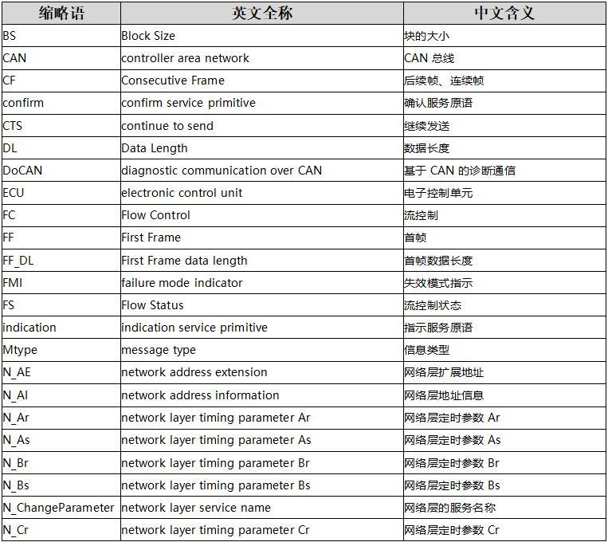
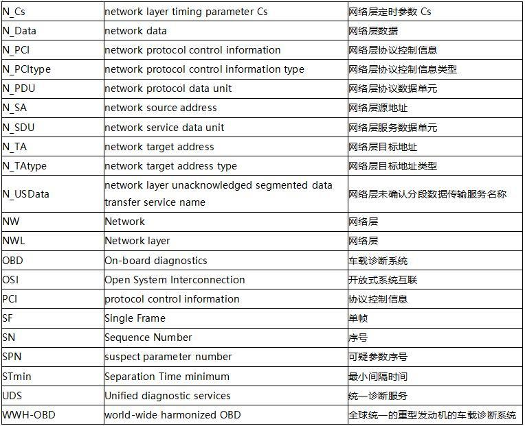

title: 03 15765协议介绍

ISO15765是基于CAN网络的诊断协议，其中ISO15765-2描述的是网络层协议。什么是网络层协议？其实简单来说就是提供数据传输的方法。网络层一般提供2种数据传输方法，1是单包数据传输，2是多包数据传输。网络层选择传输的方法取决于底层一次可传输的最大数据包大小。	

ISO15765网络层服务

- 协议功能

　　a)发送/接收最多4095个字节的数据信息；

　　b)报告发送/接收完成状态。

网络层内部传输服务，CAN总线上的数据帧没帧只能传输8个字节，ISO 为了适应CAN总线上的数据传输，根据诊断报文数据长度的不同规定了单帧传输和多帧传输两种方式。

ISO 15765-2采用4种数据帧，分别是单帧（SF）、首帧（FF）、连续帧（CF）、流控帧（FC）下面将分别介绍这四种帧的数据结构

# 单帧传输

## 单帧

当应用层的诊断服务数据可以利用单帧CAN数据传送时，可采用单帧传送方式（正常地址，数据长度下小于等于7，扩展帧情况下，数据长度小于等于6）

       当N_PCItype = 0时，表示此帧为单帧，SF_DL为此次单包传输的数据量。

**0X 单帧（SF）：首个字节为0（4bit）+ Data Length(4bit)，控制信息占用1个字节**

举例：Data 02 10 02 55 55 55 55 55，02表示接收方应知晓，这一个单帧只有2个有效字节。后续的字节是自动填充的无效字节。

# 多帧传输

多帧传送方式中，网络层根据需要，将诊断数据进行拆分成一个首帧和多个连续帧。首帧（扩展及混合地址-5字节，正常地址-6字节）包括了分段数据的总长度信息以及一些数据帧；每个连续帧的第一个字节包含拆分的顺序编号，后面的七个字节用于存放诊断数据。接收端在接收到连续帧后根据接收数据帧的编号重组服务数据。

## 首帧

       当N_PCItype = 1时，表示此帧为首帧，FF_DL为此次多包传输的数据量，FF_DL的最大值为4095。

当应用层的诊断服务数据可以利用单帧CAN数据传送时，可采用单帧传送方式（正常地址，数据长度下小于等于7，扩展帧情况下，数据长度小于等于6）

**1X XX 首帧（FF）：前两个字节为1（4bit）+ Data Length(12bit)，控制信息共占用2个字节。**

举例：Data 10 14 2E F1 90 01 02 03，0x014表示，接收方应知晓，这一个多帧组合共有20个字节。

## 连续帧

       当N_PCItype = 2时，表示此帧为序列帧，SN为序列帧的计数，用于数据的有序传输，第一次发送SN的值为1，当SN的值溢出时，SN从0开始计数。

**2X 连续帧（CF）：第一个字节为2+SN（最多16个SN，溢出后从0开始重新计数），控制信息占用1个字节。**

我们通常记首帧为0x20，之后的第一个连续帧自然是0x21，之后一直到0x2F，下一个是0x20，循环。

## 流控帧

       当N_PCItype = 3时，表示此帧为流控帧，FS为数据流传输的状态信息，BS为接收方发送流控帧的间隔（以CF帧为单位），ST为发送方间隔发送序列帧的时间间隔。

**3X 流控制帧（简称流控帧，FC）：前三个字节为3（4bit）+流状态（FS，4bit）+块大小（BS，8bit）+最小间隔时间（STmin，8bit），控制信息共占用三个字节。**

举例：Data 30 00 14 AA AA AA AA AA，多帧发送方应知晓，这是一个流控帧，允许你方继续发送，CF数量无限制，上一个连续帧的确认接收（ACK）到新的连续帧开始发出的最小间隔时间为20ms。

当FS=0时，代表接收方已经准备好数据传输，发送方可以发送序列帧；当FS=1时，发送方继续等待流控帧且复位N_BS的超时定时器；当FS=2时，代表接收方的内存不够接收FF_DL长度的数据，发送方结束数据传输。当BS=0时，接收方不再发送流控帧，发送方可以一直发送序列帧直到数据传输完成。

- 汇总 举例：

| 单帧   | 02 10 02 55 55 55 55 55                        | 0表示单帧，2表示长度，10 02表示数据，其他为位填充            |                                                          |
| ------ | ---------------------------------------------- | ------------------------------------------------------------ | -------------------------------------------------------- |
| 首帧   | 10 14 2E F1 90 01 02 03                        | 1表示首帧，0+14表示数据长度（20），后面的为数据              |                                                          |
| 连续帧 | 21 02 03 04 05 06 07 0822 09 0A 0B 0C 0D 0E 0F | 2表示连续帧，1,2,3…F,0,1,2…                                  |                                                          |
| 流控帧 | 30 02 20 55 55 55 55 55                        | 3表示流控帧，0表示继续发送，02一次允许发送的连续帧个数，20表示两个连续帧之间的时间间隔为20ms | 红色部分为0表示可以无限发送，流控帧只有3个字节，无数据。 |

常用缩略词

