# 05 doip协议

## 1、概述

​     DoIP是Diagnostic communication over Internet Protocol 的简称，顾名思义，就是通过网络协议进行诊断通信。

​     ISO 13400的所有部分都基于ISO/IEC 7498-1中规定的OSI基本参考模型，该模型将通信系统分为七层。从上到下称为应用层(第7层)、表示层、会话层、传输层、网络层、数据链路层和物理层(第1层)。ISO 13400使用了这些层的一个子集。ISO 13400为DoIP指定了传输层、网络层、数据链路层和物理层。

​     ISO 13400由以下部分组成，其总称为"道路车辆-互联网协议诊断通讯"(DoIP):

​         1、 一般信息和用例定义。

​         2、 传输协议和网络层服务。

​         3、 基于IEEE 802.3的有线车辆接口。

​     以下部分正在筹备中

​         4、 以太网诊断连接器。

​         5、 一致性测试规范。

​     ISO 13400协议与OSI基本参考模型的对应关系可参考下图：

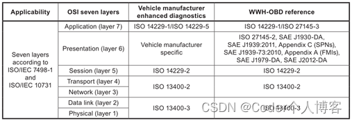

## 2、DoIP的优势

​     1、更快的诊断响应。

​     2、传输大量数据的时间更短（用于软件刷新和参数下载）。

​     2、使得远程的直接诊断成为可能。

## 3、基本要求

### 3.1、数据链路与物理层要求

​     根据ISO-13400的要求，DoIP通信在物理层支持100BASE-TX (100 Mbit/s Ethernet) 和10BASE-T (10 Mbit/s Ethernet) 两种制式。DoIP设备的MAC地址也符合IEEE 802.3 的要求。

### 3.2、传输层与网络层要求

​     ISO-13400规定，DoIP通信在传输层上必须同时支持UDP和TCP，并将UDP和TCP的使用场合进行了定义，对所使用的端口号也进行了定义。后续会说明。

​     ISO-13400规定，DoIP通信在网络层上使用IPv6协议，但是为了后向兼容的原因，也支持IPv4。此外，对于IPv4来说，还要支持地址解析协议（ARP），对于IPv6来说，还要支持邻居发现协议(NDP)，这两个协议是用于在只知道IP地址的情况下获取MAC地址的。

## 4、基本数据类型

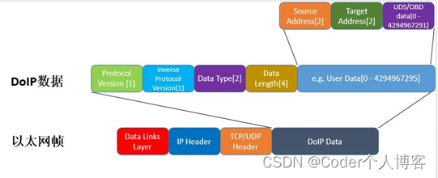

DoIP数据作为SDU层层向下传递，直至构成完整的以太网帧，通过物理层的介质发送出去。DoIP的数据内容分为5个部分：

​     1、所使用的ISO13400版本信息，占用1个字节。

​     2、所使用的ISO13400版本信息依比特取反，占用1个字节。

​     3、数据类型，占用2个字节（标识本帧数据的用途，比如用于上报或请求车辆信息、诊断命令、诊断逻辑链接激活、alive check等）。

​     4、数据长度，占用4个字节（标识后面的数据长度）。

​     5、诊断数据，长度为0至2的32次方减1，这里的数据又分为sender address、receiver address、应用数据这三部分。

**4.1、ISO13400版本取值范围**

​     DoIP版本取值范围如下表：

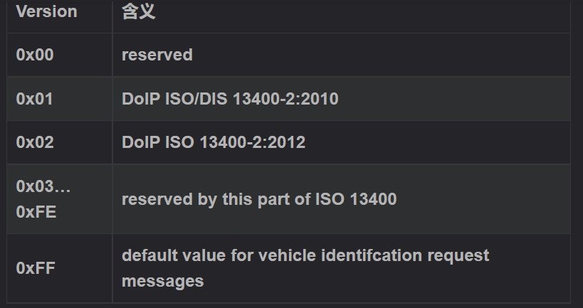

**4.2、ISO13400数据类型**

DoIP数据的第三个部分是data type,即描述数据包中的数据类型，取值范围如下图所示：

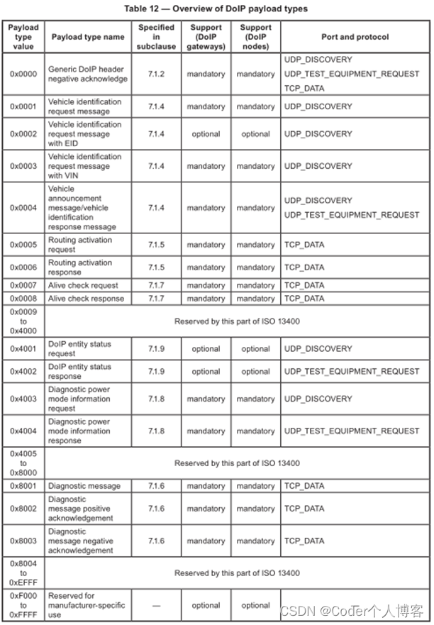

上面这个表格不但定义了代表不同数据类型的值，还说明了具体的数据类型应该是通过UDP还是TCP来发，并定义了应该在哪个端口上发。

​     其中最常用的数据类型应该是0x8001，0x8002，0x8003了，代表的含义分别是诊断消息、诊断消息正响应和诊断消息负响应。

0x0001至0x0004用于汽车标识上报或请求，只能通过UDP报文来发送这种命令，主要用于在汽车和诊断仪进入网络之后、诊断连接建立之前的车辆发现过程。

0x0005和0x0006标识的Routing activation request 和 response用于在socket建立之后，进行诊断通信的请求。

0x0007和0x0008用于Alive check，用于检查当前建立的诊断连接socket是否仍然在使用中，如果不再使用，则关闭socket释放资源。

**4.3、ISO13400完整数据结构举例**

​     下图是一个DoIP数据完整结构的举例

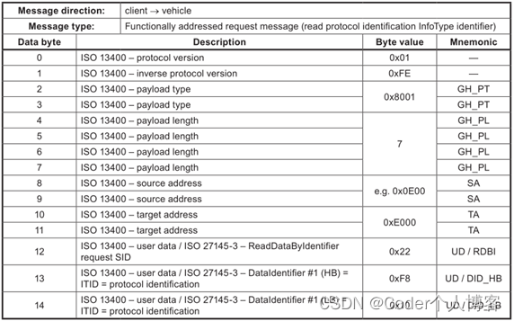

## 5、DoIP的使用场景

​     ISO13400中定义了DoIP的4种使用场景。

**5.1、一辆车和一个外部测试设备实例之间的直接物理连接**

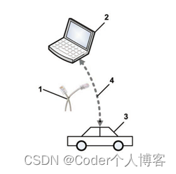

**5.2、一辆车和一个外部测试设备实例之间的网络连接**

​     这种通信场景意味着多个车辆和多个外部测试设备被连接到同一个网络。这意味着外部测试设备应有可能识别网络中的车辆，并选择与之建立通信的特定车辆。从车辆的角度来看，这意味着车辆应该实现识别机制，并且应该能够处理或拒绝多个连接尝试，因为其他外部测试设备可能会干扰当前建立的通信。外部测试设备和车辆都应支持将自身集成到现有IP网络中，其中包括网络层参数的协商。这种通信场景通常发生在车辆连接到现有网络或无线基础设施时，其他车辆和外部测试设备(例如维修车间网络)也使用这些网络或无线基础设施。

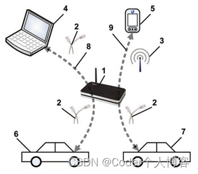

**5.3、多辆车和一个外部测试设备实例之间的网络连接**

​     从车辆的角度来看，这个通信场景与3.2中描述的场景相同。只有外部测试设备能够支持多个连接(即插座)。这种通信场景可能发生在，例如，有一个专用的flash重编程服务器，它可以同时更新多辆汽车(例如，在经销商或制造区域)。

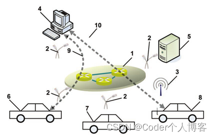

**5.4、一辆车与外部测试设备的多个实例之间的网络连接，或外部测试设备的单个物理实例上的测试应用程序**

​     在这种情况下，车辆应能够清楚地分离负责每个逻辑链路的每个外部测试设备的诊断请求和响应。此外，在单个测试设备实例上运行的测试设备或应用程序应能够检测到其他测试设备实例或应用程序已经与同一车辆通信，因此，车辆不可能同时支持所有操作。

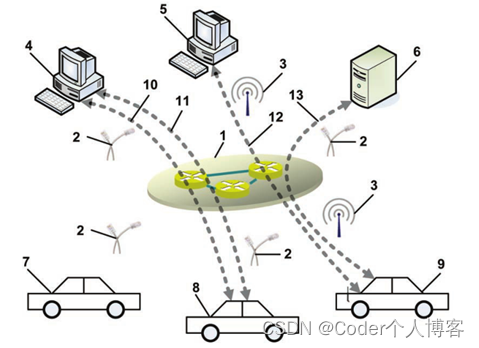

## 6、DoIP诊断通信建立连接的过程

​     DoIP诊断同学建立连接分为四个过程：

​         1、物理连接（Physically connection）。

​         2、车辆声明（Vehicle Discovery）。

​         3、通信建立（Connection Establishment）。

​         4、诊断通信（Diagnostic Communication）。

**6.1、物理连接**

​     车外客户端（Test equipment）用相应的接口卡（IP-Based Network）连接车身边缘节点（DoIP Edge Node GW）。在ISO 13400协议中规定外部诊断设备连接边缘节点，且需用激活线来激活边缘节点的DoIP功能。

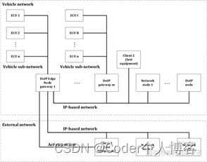

物理连接后，通过相应手段获取IP地址，建立通信。

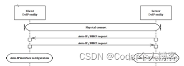

**6.2、车辆声明**

​     物理连接后，车辆会议广播的形式发送三次车辆声明，声明的信息可以包括：

​         1、VIN

​         2、EID

​         3、GID

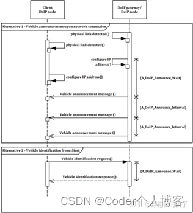

如果诊断设备没有获取车辆信息，也可以主动请求（Vehicle Identification request）来获取相应信息（如上图所示）。

**6.3、通信建立**

​     在DoIP协议中，有Socket概念：Socket一端连接着IP地址，一端连接着Port端口。并且Socket对于芯片而言是一种资源。因此有激活失效之分。

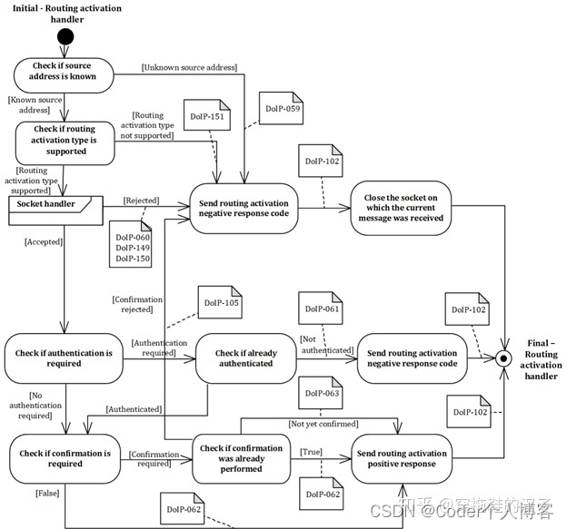

在协议中定义了Payload Type （0005/0006）用于激活Socket。

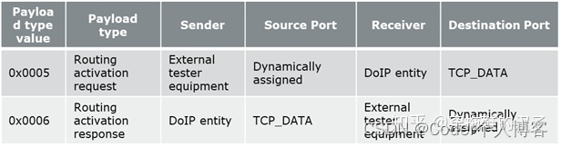

激活后，Socket使能，接下来就可以进行诊断通信。

**6.4、诊断通信**

​     Socket激活后，可以进行诊断通信。通信模型如下图所示：

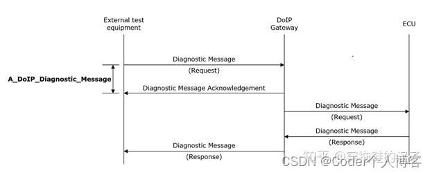

外部Tester发送诊断请求，网关收到诊断请求后，会给与一个收到答复（Acknowledgement）,用意是告诉Tester，网关此时已收到诊断请求，与此同时网关将诊断请求（Diagnostic Request）发送至Target ECU。ECU收到诊断请求，并基于这个请求给与响应。

​     因此对于Tester而言，一共收到两个响应。

​         1、Diagnostic Message Acknowledgement；

​         2、Diagnostic Message Response；

​     每一帧响应对应的帧类型不同：

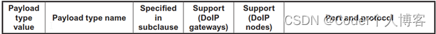

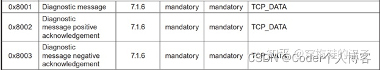

在DoIP协议中，通过PayLoad Type区分报文帧类型，用于实现不同的具体功能。但是其具体发送方式都是基于TCP/UDP协议。

​     上述整个过程，报文的发送方式都是以TCP/IP协议（当然是将传统的TCP/IP协议做了车规级应用），定义不同的阶段模型、不同的Payload Type应用报文类型，定义合理的机制，来保证Tester与ECU稳健进行诊断通信。

​     以上是整个DoIP协议定义Tester和ECU通信所需要搭建的“通信桥梁”。